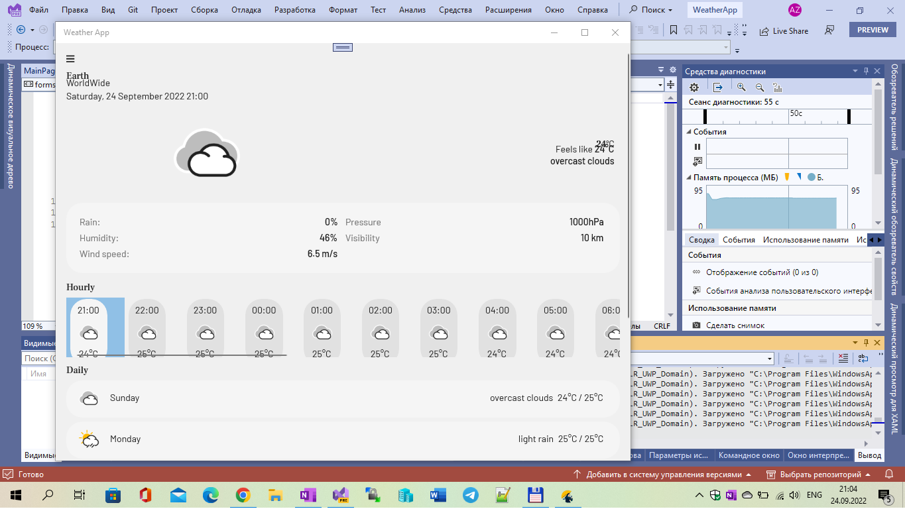
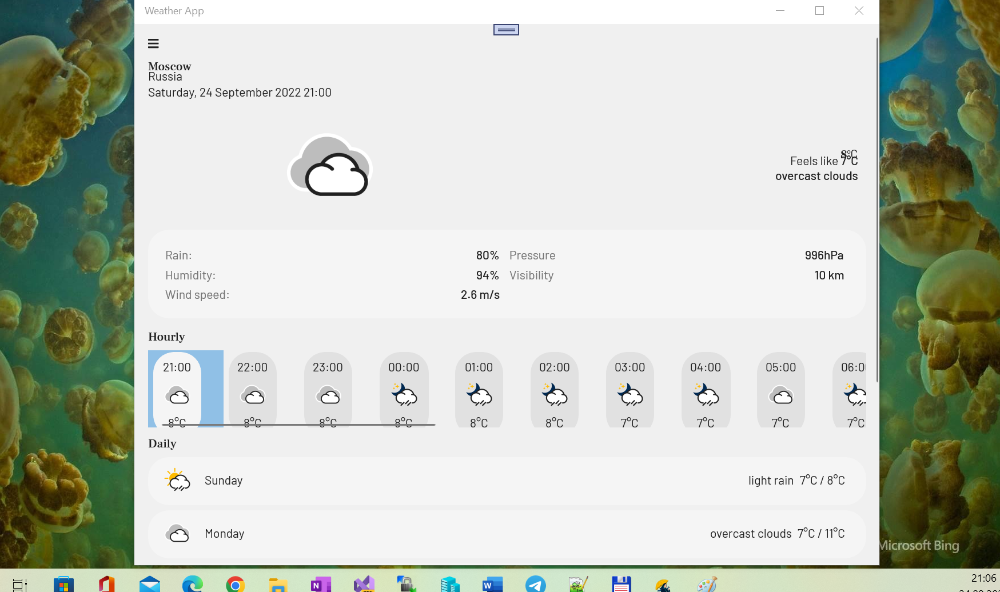

# Xamarin Weather App

**Weather App** is a simple weather app developed using Xamarin Forms. WeatherApiX is my fork of it.

The app allows you to see the weather from your current location or another location around the globe using **OpenWeather Api**. 

Using **One Call API** the app displays the current weather, 24 hours and 6 days forecast. 

You can add new locations and switch between them from the Locations screen. 

## Screenshots

## Features / My 2 cents
- UWP experimentation;
- you can change the Light mode / Dark mode (see Settings menu);
- you can change the unit system from metric to imperial;
- Cool multi-platform UI - thanks to [Darle Gheorghe](https://github.com/gheorghedarle);
- OpenWeather API preset (api key hardcoded, but it has huge limitations... so, please, get your own keys for your purposes for more api stability).

## Libraries

- [Xamarin Forms 5.0](https://github.com/xamarin/Xamarin.Forms)
- [Xamarin Essentials](https://github.com/xamarin/Essentials) (Location, Placemark, Internet Connection) 
- [Xamarin CommunityToolkit](https://github.com/xamarin/XamarinCommunityToolkit) (SideMenu, StateLayout, TouchEffect, Expander)
- [Prism.Forms](https://github.com/PrismLibrary/Prism) (MVVM, Dialogs)
- [Fody](https://github.com/Fody/Fody)
- [Newtonsoft.Json](https://github.com/JamesNK/Newtonsoft.Json)

## Tech details

- Xamarin Forms 5 used
- Windows os build >= 19041
- Min os build: 16299
- Net Standard 2.0

## Great Bugs 
- Strange localion detection via Xamarin.Essentials module ("UWP" case not realized, heh??). So, hardcode your own town if you want the fast solution of this strange problem :)

## Screenshots

  
   

## Resources / Referencies

Illustrations are from [Freepik](https://www.freepik.com/)

[Original Xamarin-WeatherApp](https://github.com/gheorghedarle/Xamarin-WeatherApp/) 

## ..

AS IS. No support. RnD only.

## .

[m][e] 2022

